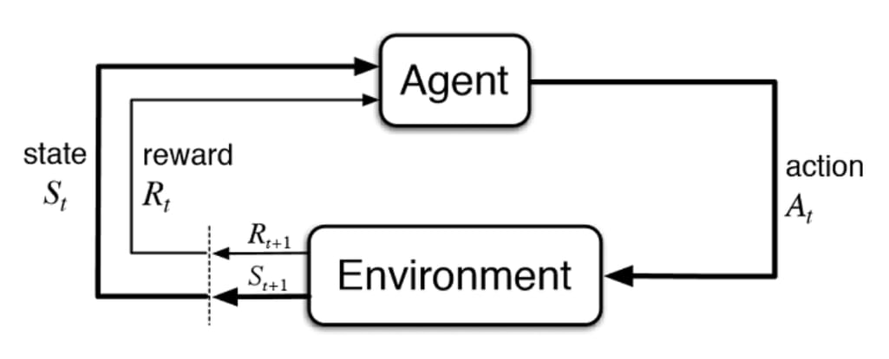
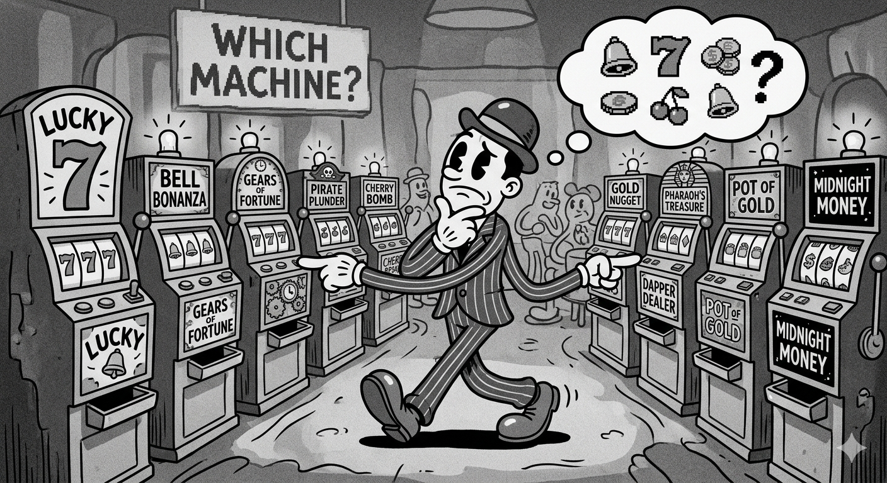
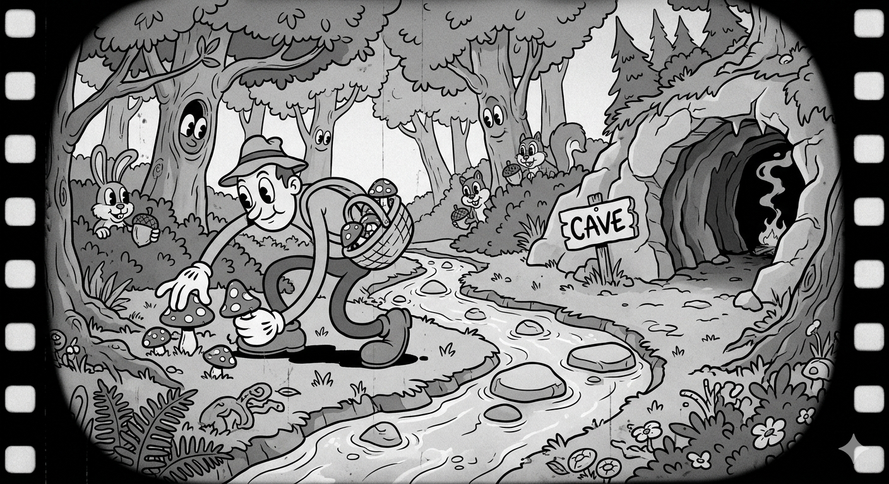

# What is Reinforcement Learning and How Does it Connect to World Models?

What is Reinforcement Learning and how does it connect to world models? This is the essence of the question I set out to answer, as a follow on to my post on David Ha's World Models paper. But to get there, we need to start from the beginning and understand why RL is hard before we can appreciate what world models actually solve.

Reinforcement Learning is a machine learning approach different from Supervised, Unsupervised, and Evolutionary techniques. It's fundamentally similar to how animals learn: goal-directed learning through interaction. An animal has a goal, find edible food, and tries different things (**explore**) until it finds something to eat (**exploit**). Over time it learns through signals: pleasure for what works, pain for what doesn't. The catch is that every exploratory step costs something. A wrong turn wastes energy. A bad meal causes harm. Learning is never free.

This is the essence of how RL works, and it's also where the central tension lives. The interaction between an agent and its environment causes learning, but that interaction has a price.

The core sub-components of this interaction are: policy, reward, value function, and model (optional). Using the food analogy: the policy is how the animal behaves at any given moment, driven by hunger. The reward is the signal after eating, did that help or not? The value function is survival itself, the long-horizon consequence that makes finding food matter at all. The model, the interesting one, is not just the environment the animal is in, but the animal's internal representation of how that environment works. A desert versus a jungle isn't just a backdrop. It's knowledge the agent has to build and carry. That distinction will matter a lot when we get to the world model paper.

The most basic example is the **k-armed bandit** scenario. Imagine the animal repeatedly choosing between *k* foraging spots, with no ability to move between them. There's no state, no time horizon, just a single independent choice each step. A fully **greedy** approach doubles down on **exploiting** the best known spot, at the cost of missing potentially better ones. Allowing for some **exploration**, an **ε-greedy** strategy, improves long-run rewards at the cost of short-term missed opportunities. In short, a greedy agent doesn't know what it doesn't know. There is a cost, at each step, in exploring an unknown action versus choosing a known valuable one.

The bandit problem keeps things simple by removing state and time. A bad exploratory step costs one reward and nothing else. What happens when your actions not only produce rewards, but change where you end up? The animal now moves across terrain, crosses rivers, goes up hills, with each decision about where to go next changing its situation. Its state is based on its location, level of hunger, and its surroundings. Each action reshapes the next decision. The sequence of actions and states from start to finish, say dawn until dusk, is called an **episode**.

The reward is separate from the state. Did this action move the animal closer to not being hungry? The animal isn't just optimizing for the next meal, it's optimizing for survival across the whole episode. That cumulative future reward is called the **return**. Not all future rewards are equal either. Food available right now matters more than food that might be available tomorrow. The **discount factor** captures this, weighting near-term rewards more heavily than distant ones.

The key assumption holding all of this together: the animal's current state, where it is, how hungry it is, what's around it, contains everything it needs to make a good decision. It doesn't need to remember every step that led here. This is the **Markov property**, and it's what makes the whole framework computationally tractable.

This is where the cost from the bandit quietly multiplies. A wrong exploratory action doesn't just miss one reward, it lands the animal somewhere worse, with fewer options, at lower energy. That ripple carries forward through every subsequent decision in the episode.

Value-based methods gave the animal a map, an estimate of how good each situation is. Policy gradient methods ask: what if the animal skipped the map entirely and just learned how to act directly?

One step. One trajectory. Now many full episodes. The cost keeps climbing.

The animal was estimating how valuable each situation was, building a map of the landscape from experience. **Policy gradient** methods flip this. Rather than estimating value and deriving behavior from it, the animal directly adjusts how it behaves, its **policy**, based on what worked across entire episodes.

The core idea is simple: run an episode, observe how well it went, and nudge the policy toward actions that produced better outcomes. This is **REINFORCE**. If moving to the riverbank at dawn produced a good episode, do that more. If wandering into the open plain didn't, do that less.

One episode is too noisy to learn from reliably. The animal needs many full episodes just to get a stable signal about whether a single behavioral change was actually good. This noise is called **variance**. A **baseline** helps by anchoring each episode's return against an average so the signal is cleaner. **Actor-critic** methods go further, introducing a **critic**, a mid-episode estimate of how good a situation is, reducing the need to wait for full episode returns. But the fundamental dependency on real interactions remains.

The **policy gradient theorem** shows you can optimize behavior without ever modeling how the environment works. That's powerful, but it's also the cost. Every gradient update requires the animal to actually go out and forage. There's no shortcut, until the animal can simulate what would happen before it acts.

| Scenario | What's Being Optimized | Cost of Exploration | What's Missing |
|---|---|---|---|
| k-armed bandit | Single action value | One real step | State, time |
| Foraging across terrain | Value over states and transitions | One trajectory, compounds across states | A model of dynamics |
| Policy gradients | Policy parameters directly | Many full episodes | A differentiable environment |
| World models | Policy inside imagination | Near zero real interactions | — |

Each row in this table represents the same problem getting harder. The final row is what the World Models paper actually builds.

The paper built a world model for a simple game with two models working together, V and M. The V model is based on the VAE architecture, compressing raw images into a manageable latent space vector z. The M model is based on the MDN-RNN architecture, storing a compressed summary of the sequence so far in a 256 dimensional hidden state h, while also predicting what the next state will look like given the current state and action. Critically, both V and M are trained without any reward signal at all. They learn perception and dynamics first, before the RL problem even starts. Together, V and M form the world model itself. The C model, a simple RL agent, receives the compressed state z and the memory h as a single vector and uses that to decide what action to take.

So what do world models solve?

In the reinforcement learning literature, the model is listed as an optional sub-component. Sutton and others explored this idea as far back as 1990, building simple lookup table models that captured the basic intuition but didn't scale to complex environments. In 2018, Ha and Schmidhuber proposed an architecture that finally made it work. By combining a VAE for compressed perception and an MDN-RNN for predictive memory, they built a simulation rich enough to train inside. At every timestep, the world model delivers a compressed state and a memory of what has happened so far to a simple RL agent, without that agent ever needing to interact with the real environment.

Going back to our animal one last time. The animal wakes up, perceives its surroundings through V, and draws on its memory of past episodes through M. It knows from experience that the meadow to the east had food at this time of year. Rather than wandering out and finding out the hard way, it can think it through first. It rehearses in its mind before it acts in the world.

That is what world models solve. Not just sample efficiency, not just variance, but the cost of learning from reality itself. The model was always optional in the RL framework. The 2018 paper is where it finally became essential.

---

## Sources

Sutton, R.S., Barto, A.G. (2018). *Reinforcement Learning: An Introduction* (2nd ed.). MIT Press. http://incompleteideas.net/book/the-book-2nd.html

Ha, D., Schmidhuber, J. (2018). *World Models*. arXiv:1803.10122. https://arxiv.org/abs/1803.10122

Schmidhuber, J. (1990). *Making the World Differentiable: On Using Supervised Learning Fully Recurrent Neural Networks for Dynamic Reinforcement Learning and Planning in Non-Stationary Environments*. Technical Report FKI-126-90, Technische Universität München.

Sutton, R.S. (1990). *Integrated Architectures for Learning, Planning, and Reacting Based on Approximating Dynamic Programming*. Proceedings of the Seventh International Conference on Machine Learning.